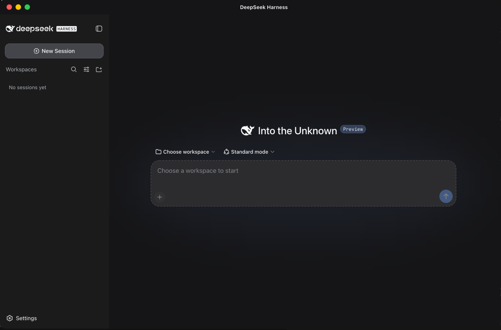

<div align="center">
  

# DSH Foundry

**官方 DeepSeek Harness 的零补丁桌面发行版。**

[](LICENSE)
[](https://github.com/Zenith-Lxz/dsh-foundry/releases/latest)
[](#下载)
[](#为什么不是-fork)

[English](README.en.md) · [下载](#下载) · [功能](#功能) · [构建](#从源码构建) · [许可](#许可)
</div>

## 简介

官方 DeepSeek Harness 是一个「一切皆插件」的 agent 框架，自带 Web 界面。DSH Foundry 把它打包成真正的桌面应用：Node 运行时、DSH 发行版、包管理器全部封进安装包，无需任何前置环境，首次启动自动完成 profile 供给。

本项目**不 fork、不修改官方源码**，只通过公开扩展点组合而成，上游更新直接继承。

> 官方 DSH 归 DeepSeek 所有，本项目与 DeepSeek 无隶属关系。

<p align="center">
  
</p>

## 下载

| 平台 | 安装包 |
| --- | --- |
| macOS (Apple Silicon) | [.dmg](https://github.com/Zenith-Lxz/dsh-foundry/releases/latest) |
| Windows (x64) | [.exe Setup](https://github.com/Zenith-Lxz/dsh-foundry/releases/latest) |

安装包**未签名、未公证**（ad-hoc 签名，非 Apple Developer ID）。

- **macOS**：首次启动请**右键 → 打开**，不要双击。若提示「已损坏，无法打开」，说明是旧版本；用新版本，或执行 `xattr -cr "/Applications/DSH Foundry.app"` 清除隔离属性。
- **Windows**：SmartScreen 提示时选择「更多信息 → 仍要运行」。

只使用插件、不需要桌面应用：

```bash
dsh plugin --profile <name> add @dsh-foundry/daily-bundle
```

## 功能

- **桌面应用**：跟随系统主题，macOS 交通灯安全区、Windows 标题栏控件、原生目录选择器。
- **仓库工作台**：`@file` 引用（插入路径而非文件内容）、有界搜索、**只读** Git 评审（结构上不允许 stage / commit / 改写历史）、按会话隔离的上下文与后台任务。
- **插件来源治理**：显示每个插件的来源、版本、profile、bundle、是否经 Foundry 验证、能否关闭及关闭的影响。来源只依据声明的元数据判定，缺失时显示 Unknown。
- **评测框架**：45 任务 / 9 类语料、双向验证的 oracle、配对自助法统计。

> 插件以你的用户权限运行。模型工具调用的批准提示**不适用于**插件代码和 MCP 服务器。

## 为什么不是 fork

打补丁的发行版每次上游发版都要合并一次。本项目只做组合：**不 fork、不 vendor、不打补丁、不深导入、不 monkey patch**，开发所依赖的上游 checkout tracked 改动为 0。

```bash
pnpm run gate:coupling   # 发布闸门：拒绝任何本地源码路径与未声明子路径的导入
```

业务流量全部走官方通路（HTTP / WebSocket / Typert）；Electron IPC 只承载窗口、目录选择、外链与生命周期，工作台模块不得 import 桌面 bridge。

## 从源码构建

```bash
pnpm install
pnpm run bundle
pnpm run build:icon
pnpm run package:darwin-arm64    # 或 package:win32-x64
pnpm run installer darwin-arm64  # 生成 release/installer/*.dmg
pnpm run installer win32-x64     # 生成 release/installer/*.exe
```

| 环境 | 版本 |
| --- | --- |
| Node | ≥ 24.18.0（`mise.toml` 已固定） |
| pnpm | 11.7.0 |
| 官方 DSH | `0.1.0-rc.6`（接受范围 `>=0.1.0-rc.6 <0.2.0`，见 [compatibility.json](compatibility.json)） |

仓库结构：

```text
apps/desktop/     Electron 主进程、preload、窗口策略
packages/         适配器、bridge 契约、布局与原生插件、工作台、治理、评测
scripts/          staging、闸门、打包、安装器
corpus/           评测语料
assets/           图标
```

## 项目状态

macOS Apple Silicon 为验收目标，已完成打包验收；Windows x64 构建候选可在真实主机安装运行，尚未走完同等验收矩阵。

| 检查 | 结果 |
| --- | --- |
| `pnpm run mechanics` | 15 / 15 |
| `pnpm run smoke:app` | 19 / 19 |
| `pnpm run verify:window` | 16 / 16 |
| `npx vitest run` | 1134 通过 / 51 文件 |

关于编程效率**不作任何声明**：语料按 45 任务设计，在册对照仅有一次 5 任务试跑，promotion 结论为 **UNDECIDED**（数据见 [`evidence/pilot-report.md`](evidence/pilot-report.md)，`tests/readme-claims.test.ts` 会拒绝任何证据之外的数字）。**从未与** Claude Code、Codex 或任何其他 DSH 发行版比较过。

## 许可

[MIT](LICENSE)。与 DeepSeek 无隶属关系；应用图标中的鲸鱼标志取自上游 Harness，商标归 DeepSeek 所有（[说明](assets/README.md)）。
